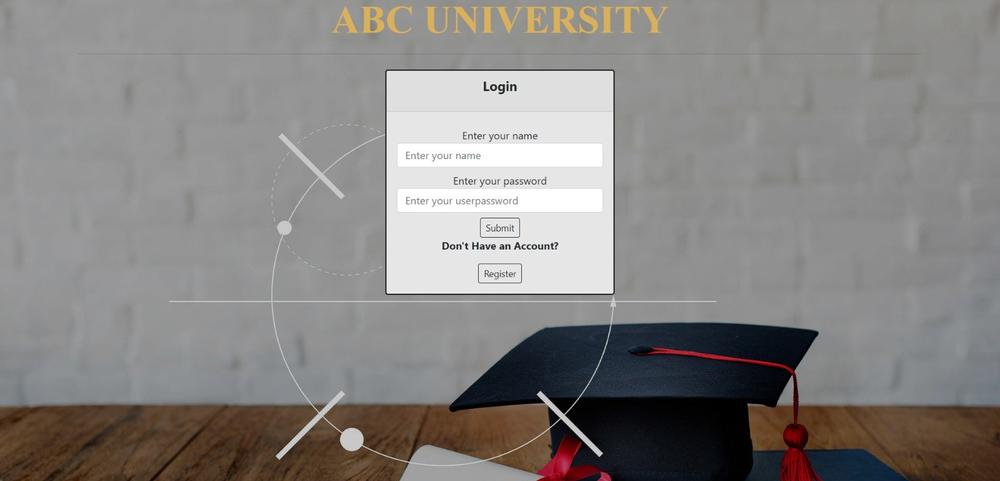
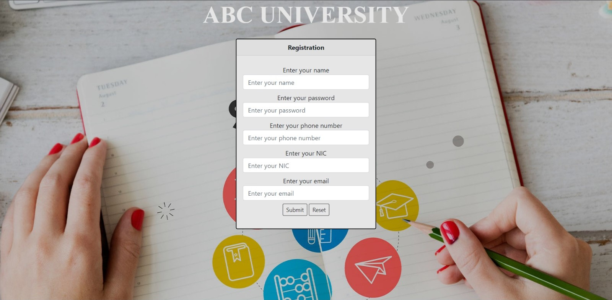
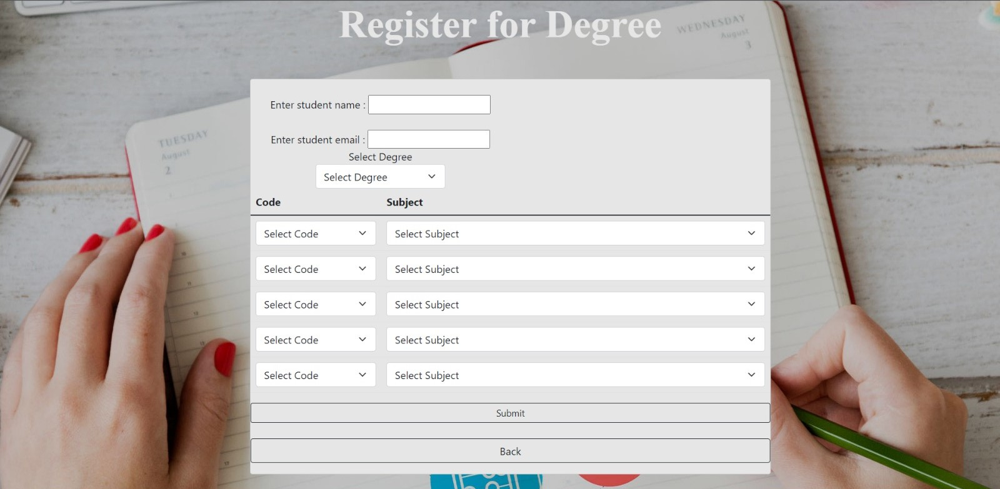
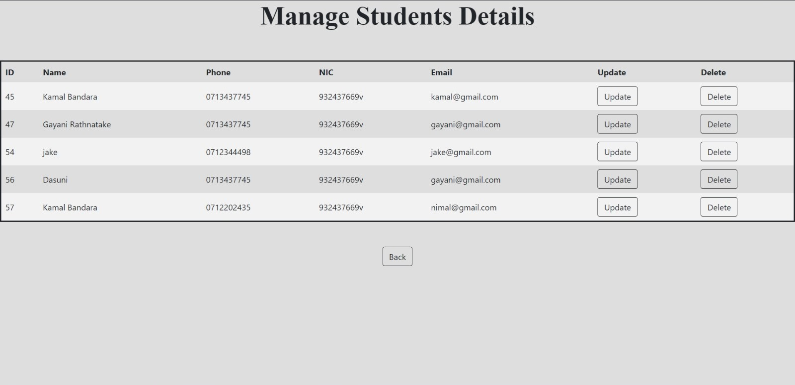
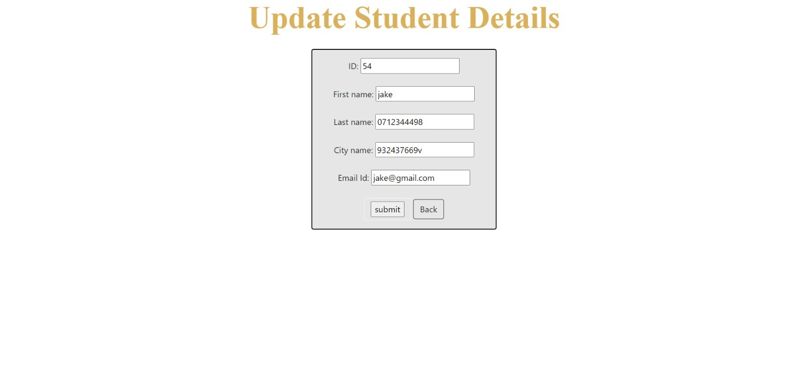
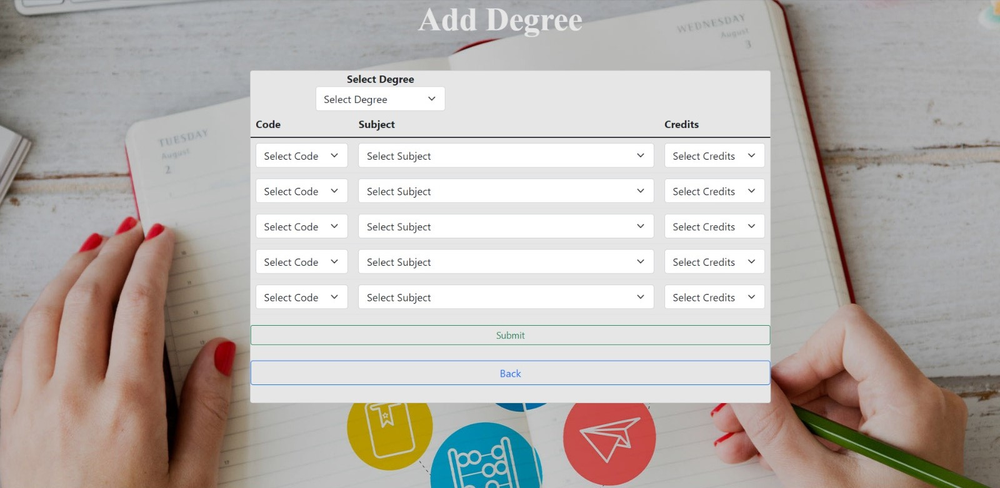
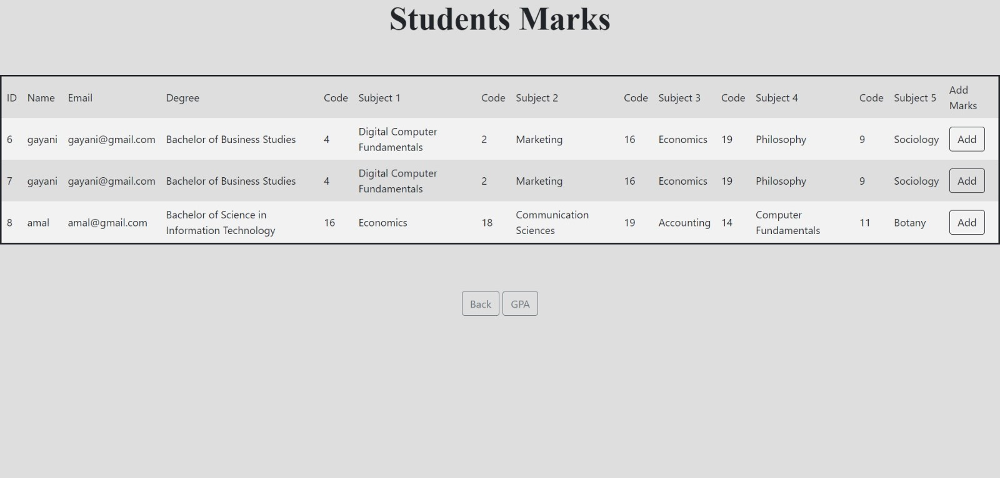
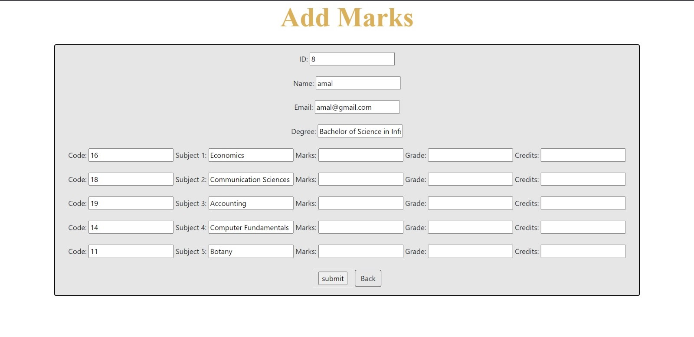
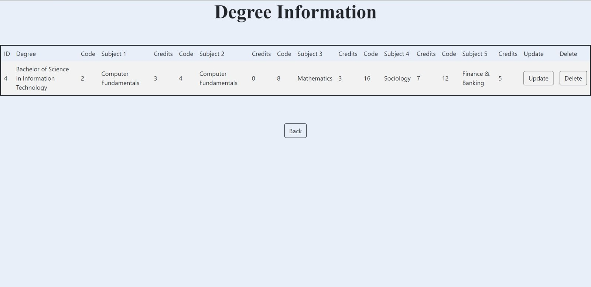
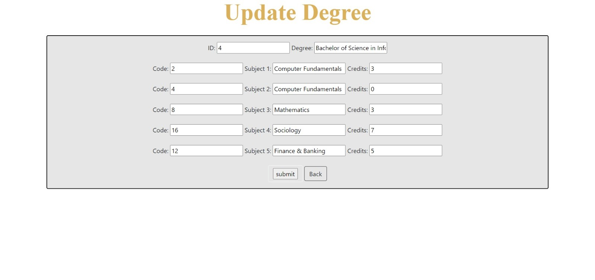

<html>
    <head>    
    </head>
    <body>
        <h1>University Results Management System </h1>
         
        <h3>What is this repository for?</h3>
        <ul>
            <li> University Results Management System for University </li>
        </ul> 
        <h3>Features</h3>
        <ul>
            <li>User Sign Up</li>
            <li>User Sign In</li>
            <li>Register for Degree </li>
            <li>Catogory Selection</li>
            <li>Add Degree information , Student Details and Marks  </li>
            <li>View Student Details and Degree Information Student Marks Details Details</li>
            <li>Admin and User Access</li>
            <li>Add Student, Delete and Edit features</li>
        </ul>
        
          
          
          
          
          
          
          
          
          
          
          
          
          
          
        
   
    
        <h3>contact details</h3>
        <ul>
            <li>darshanithennakoon371@gmail.com</li> </ul>
        </ul>
    </body>
</html>
